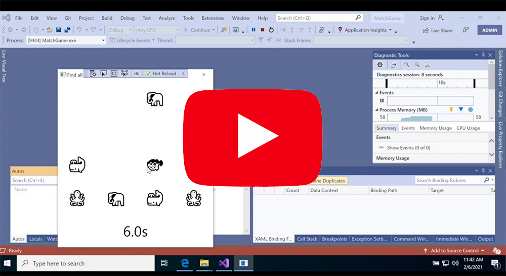
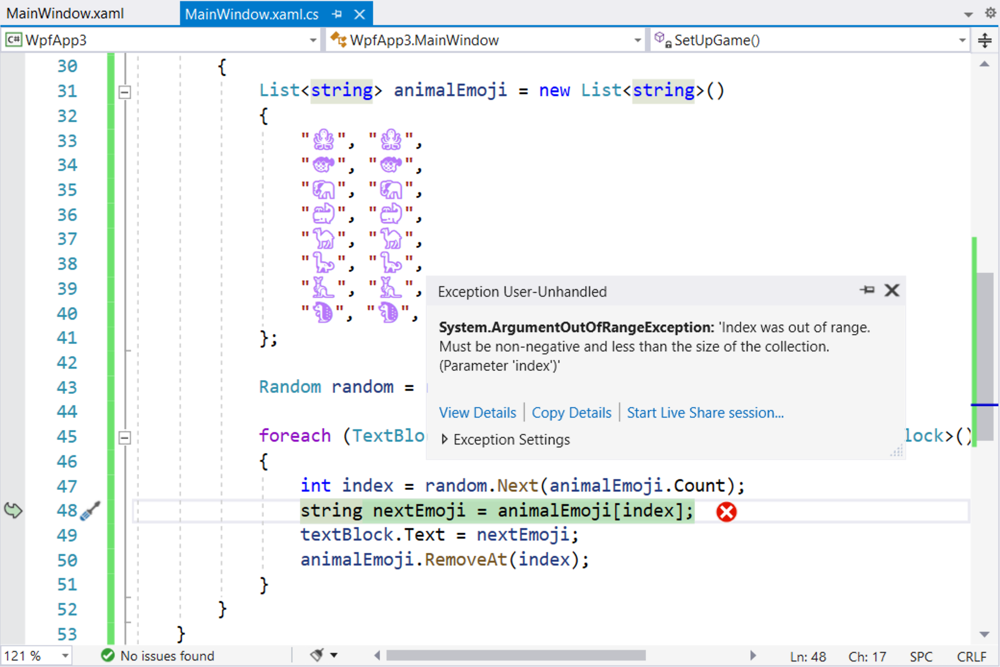

# Head First C#, 4th Edition
This GitHub project contains source code, downloadable PDFs, graphics, and additional files for the projects in the 4th edition of *Head First C#* (O'Reilly Media 2020).

***[Troubleshooting problems with Chapter 1](#did-you-run-into-trouble-with-the-project-in-the-first-chapter)***

## What's on this page

 * [Read the first four chapters today!](#read-the-first-four-chapters-today)
 * [What will you learn from this book?](#what-will-you-learn-from-this-book)
 * [What's so special about this book?](#whats-so-special-about-this-book)
 * [Video Walkthroughs](#video-walkthroughs)
 * [How to use the code in this repository to follow along with the book](#how-to-use-the-code-in-this-repository-to-follow-along-with-the-book)
    * [Use the GitHub website to browse the code](#use-the-github-website-to-browse-the-code)
    * [Load the chapter projects in Visual Studio](#load-the-chapter-projects-in-visual-studio)
    * [Load the Unity projects with Unity Hub](#load-the-unity-projects-with-unity-hub)
 * [Downloadable project PDFs](#downloadable-project-pdfs)
 * [Download all of the Unity Labs](#download-all-of-the-unity-labs)
    * [Unity Labs from the book](#unity-labs-from-the-book)
    * [Additional Unity Labs](#additional-unity-labs)
    * [Unity Lab code](#unity-lab-code)
 * [All of the additional material that you can download](#all-of-the-additional-material-that-you-can-download)
 * [**Did you run into a problem in the first chapter?**](#did-you-run-into-trouble-with-the-project-in-the-first-chapter)
 * [**Did you run into trouble with pages 77 and 78?**](#did-you-run-into-trouble-with-pages-77-and-78)
 * [Did you find an error in the book?](#did-you-find-an-error-in-the-book)
 * [License and Copyright](#license-and-copyright)

## Read the first four chapters today!

Do you want to learn C#? Are you trying to figure out if our book is right for you? We think our book is one of the most effective ways to learn C#. But you don't have to take our word for it! We want you to have the best C# learning experience possible, so to make things easy for you we've provided the **first four chapters of our book for free**.

Download a **free PDF** of the first 4 chapters: [`Head_First_CSharp_4e_chapters_1_to_4.pdf`](https://github.com/head-first-csharp/fourth-edition/raw/master/Head_First_CSharp_4e_chapters_1_to_4.pdf)

That PDF includes the complete introduction, chapters 1 through 4, the first two Unity Labs, and the complete *Visual Studio for Mac Learner's Guide* appendix, as well as the full table of contents and index (so you can see everything that we cover).

Try out our book today and see what you think!

☮️♥️👾 Jenny and Andrew

## What will you learn from this book?

Dive into C# and create apps, user interfaces, games, and more using this fun and highly visual introduction to C#, .NET Core, and Visual Studio. With this completely updated guide, which covers C# 8.0 and Visual Studio 2019, beginning programmers like you will build a fully functional game in the opening chapter. Then you'll learn how to use classes and object-oriented programming, create 3D games in Unity, and query data with LINQ. And you'll do it all by solving puzzles, doing hands-on exercises, and building real-world applications. By the time you're done, you'll be a solid C# programmer--and you'll have a great time along the way!

## What's so special about this book?

Based on the latest research in cognitive science and learning theory, Head First C# uses a visually rich format to engage your mind rather than a text-heavy approach that puts you to sleep. Why waste your time struggling with new concepts? This multisensory learning experience is designed for the way your brain really works.

## Video Walkthroughs

Find the video walkthroughs for Chapter 1 on our [YouTube channel](https://www.youtube.com/channel/UCnbMYjZgh6fSB6BBww1Wfbw/featured).

## How to use the code in this repository to follow along with the book

This repository contains all of the code for every project in the book. We created a video walkthrough to help

You can jump directly to the different sections of the video:
* Installing Visual Studio - [1:20](https://www.youtube.com/watch?v=73PGlIbkvV8&t=80s)
* Launch Visual Studio and create a "Hello World" app - [8:30](https://www.youtube.com/watch?v=73PGlIbkvV8&t=510s)
* Download the code from the book and run the Animal Matching game project from Chapter 1 - [10:30](https://www.youtube.com/watch?v=73PGlIbkvV8&t=630s)
* Run the ASP.NET Blazor WebAssembly Animal Matching game from the Visual Studio for Mac Learner's Guide - [12:45](https://www.youtube.com/watch?v=73PGlIbkvV8&t=765s)
* Run the .NET Core Console App Hide and Seek game from Chapter 10 - [14:35](https://www.youtube.com/watch?v=73PGlIbkvV8&t=875s)

The code for the projects in each chapter is in the [`Code` folder](https://github.com/head-first-csharp/fourth-edition/tree/master/Code). 
* The `Code` folder subfolder for each chapter. For example, the code for all of the projects in Chapter 2 are in the [`Code/Chapter_2` folder](https://github.com/head-first-csharp/fourth-edition/tree/master/Code/Chapter_2).
* Inside each chapter folder you'll find each of the projects. For example, the PickRandomCards Console App project on page 106 in Chapter 3 is in the [`Code/Chapter_3/PickRandomCards` folder](https://github.com/head-first-csharp/fourth-edition/tree/master/Code/Chapter_3/PickRandomCards).
* When there are both WPF and Blazor versions of a project, the chapter folder will contain both of them. For example, on page 118 you create a WPF version of the card picker app called PickACardUI, which you can find in [`Code/Chapter_3/PickACardUI`](https://github.com/head-first-csharp/fourth-edition/tree/master/Code/Chapter_3/PickACardUI). The code for the Blazor version on page 714 is in [`Code/Chapter_3/PickACardBlazor`](https://github.com/head-first-csharp/fourth-edition/tree/master/Code/Chapter_3/PickACardBlazor).
* Code solutions for the *Sharpen Your Pencil*, *Pool Puzzle*, *Magnets*, and other pencil-and-paper exercise can also be found in the chapter folders. For example, Chapter 3 has two *Sharpen Your Pencil* exercises that have code solutions that run. The first one is on page 135, and the code can be found in [`Code/Chapter_3/SharpenYourPencil`](https://github.com/head-first-csharp/fourth-edition/tree/master/Code/Chapter_3/SharpenYourPencil). The second one is on page 153, and the code can be found in [`Code/Chapter_3/SharpenYourPencil_2`](https://github.com/head-first-csharp/fourth-edition/tree/master/Code/Chapter_3/SharpenYourPencil_2).
* The code for the Unity Lab projects can be found in the [`Unity_Labs/Projects`](https://github.com/head-first-csharp/fourth-edition/tree/master/Unity_Labs/Projects) folder.

### Use the GitHub website to browse the code

The most common way people use the code on this website is to look at our solution. (Remember, it's ***not** cheating* to look at our solution while you're solving the problem! That's a valid and often very effective way to learn.) You 

* In a code folder, you'll see a **solution file** that ends with `.sln`. Visual Stuido uses this file when you load the code. You can ignore it if you're reading the code on the GitHub page.
* The code folder contains a **project folder** with the actual code. Most of the solutions in the book contain one project (in Chapter 9 you'll learn about unit testing, and create solutions with more than one proejct). 
  * For example, the code for the PickRandomCards project in Chapter 3 on page 106 is in the [`Code/Chapter_3/PickRandomCards/PickRandomCards` folder](https://github.com/head-first-csharp/fourth-edition/tree/master/Code/Chapter_3/PickRandomCards/PickRandomCards).
  * The CardPicker class that you finish on page 110 is in [`Code/Chapter_3/PickRandomCards/PickRandomCards/CardPicker.cs`](https://github.com/head-first-csharp/fourth-edition/tree/master/Code/Chapter_3/PickRandomCards/PickRandomCards/CardPicker.cs)

### Load the chapter projects in Visual Studio

All of the projects for each chapter can be loaded in Visual Studio. The easiest way to run the code from this repository is to download and extract a zip of the entire repository:
1. Download the zip file of the entire repository. Here's a direct link to download it: [`master.zip`](https://github.com/head-first-csharp/fourth-edition/archive/master.zip) – it may get saved as `fourth-edition-master.zip`.
  * You can also find that link by going to the [top page in the repository](https://github.com/head-first-csharp/fourth-edition), clicking the *Code* dropdown button just above and to the right of the code listing, and choosing *Download zip*
2. Extract `master.zip` (or `fourth-edition-master.zip`) – it has all of the files in the repository.
3. Go to the chapter folder (e.g. `Code/Chapter_3`) and open the project folder inside it (e.g. `PickRandomCards`).
4. Double-click on the solution (`.sln`) file to open it in Visual Studio. You can also use the Visual Studio menu to open an existing project, navigate to the solution (`.sln`) file, and open it.

*Note that the Blazor projects can all be loaded in Visual Studio 2019 on Windows. There is currently no macOS support for WPF, so Visual Studio for Mac will not load the Mac projects.)

### Load the Unity projects with Unity Hub

You can use Unity Hub to load the Unity projects from this repository.
1. Download  [`master.zip`](https://github.com/head-first-csharp/fourth-edition/archive/master.zip) and extract it.
3. Follow the instructions in [Unity_Lab_1.pdf](https://github.com/head-first-csharp/fourth-edition/raw/master/Unity_Labs/Unity_Lab_1.pdf) to make sure Unity Hub is installed, as well as the version of Unity that we used to create the Unity Labs.
4. Open Unity Hub, click the Add button, and navigate to the folder with a Unity project (e.g. `Unity_Labs/Projects/Unity_Labs_1_and_2`), and click Open to add it to the project list in Unity Hub.
5. Double-click on the project in Unity Hub to open the proejct.
6. If the scene appears to be empty once Unity loads the project, load the scene by choosing *File >> Open Scene* from the menu, navigating to the Scenes folder, and opening `Sample Scene.unity`.

## Downloadable project PDFs

Some of the chapters have **downloadable projects**. You can download PDFs of those projects here:

* [`Chapter_5_Blazor_projects.pdf`](https://github.com/head-first-csharp/fourth-edition/raw/master/Downloadable_projects/Chapter_5_Blazor_projects.pdf) – The two Blazor projects from Chapter 5
* [`Chapter_6_Blazor_project.pdf`](https://github.com/head-first-csharp/fourth-edition/raw/master/Downloadable_projects/Chapter_6_Blazor_project.pdf) – The Blazor project from Chapter 5
* [`Chapter_8_WPF_project.pdf`](https://github.com/head-first-csharp/fourth-edition/raw/master/Downloadable_projects/Chapter_8_WPF_project.pdf) – The WPF project from Chapter 8
* [`Chapter_8_Blazor_project.pdf`](https://github.com/head-first-csharp/fourth-edition/raw/master/Downloadable_projects/Chapter_8_Blazor_project.pdf) – The Blazor project from Chapter 8
* [`Chapter_9_project.pdf`](https://github.com/head-first-csharp/fourth-edition/raw/master/Downloadable_projects/Chapter_9_project.pdf) – The *Go Fish!* project from Chapter 9
* [`Chapter_10_project.pdf`](https://github.com/head-first-csharp/fourth-edition/raw/master/Downloadable_projects/Chapter_10_project.pdf) – The *Hide and Seek* project from Chapter 10
* [`Chapter_12_boss_battle.pdf`](https://github.com/head-first-csharp/fourth-edition/raw/master/Downloadable_projects/Chapter_12_boss_battle.pdf) – The *Animal Match Game boss battle* project at the end of the book

***NOTE:** The downloadable projects for these chapters are **early release** PDFs! That means that while the code works, the projects are complete, and we've done our initial review of them, we're still working on polishing them up and putting the final touches on them. But you can definitely start using them today!**

## Download all of the Unity Labs

### Unity Labs from the book

In the *Head First C# Unity Labs* you'll use [Unity](https://unity.com/), the powerful platform for 2D and 3D game development, to explore C# and practice your C# skills.
* [Unity_Lab_1.pdf](https://github.com/head-first-csharp/fourth-edition/raw/master/Unity_Labs/Unity_Lab_1.pdf) – Explore C# with Unity
* [Unity_Lab_2.pdf](https://github.com/head-first-csharp/fourth-edition/raw/master/Unity_Labs/Unity_Lab_2.pdf) – Write C# Code for Unity
* [Unity_Lab_3.pdf](https://github.com/head-first-csharp/fourth-edition/raw/master/Unity_Labs/Unity_Lab_3.pdf) – GameObject Instances
* [Unity_Lab_4.pdf](https://github.com/head-first-csharp/fourth-edition/raw/master/Unity_Labs/Unity_Lab_4.pdf) – User Interfaces
* [Unity_Lab_5.pdf](https://github.com/head-first-csharp/fourth-edition/raw/master/Unity_Labs/Unity_Lab_5.pdf) – Raycasting
* [Unity_Lab_6.pdf](https://github.com/head-first-csharp/fourth-edition/raw/master/Unity_Labs/Unity_Lab_6.pdf) – Scene Navigation

### Additional Unity Labs

There's more to learn about Unity! We've written additional Unity Labs that go beyond the material in the book to teach you important Unity topics, and give you more practice building 3D games.
* [`Unity_Lab_7.pdf`](https://github.com/head-first-csharp/fourth-edition/raw/master/Unity_Labs/Unity_Lab_7.pdf) – Physics
* `Unity_Lab_8.pdf` - Collision Detection (coming soon!)
* `Unity_Lab_9.pdf` - Unity Boss Battle (coming soon!)
* `Unity_Lab_10.pdf` - robots (coming soon!)

### Unity Lab code

You can find the code for the Unity Lab projects in the [`Unity_Labs/Projcts folder`](https://github.com/head-first-csharp/fourth-edition/tree/master/Unity_Labs/Projects). You can load a project into Unity by:
 * Downloading it (or cloning this whole repository)
 * Adding its folder to Unity Hub
 * Opening it in Unity Hub
 * Opening *SampleScene* from the *Scenes* folder

## All of the additional material that you can download

Here's what you'll find in this repository:
* [`Head_First_CSharp_4e_chapters_1_to_4.pdf`](https://github.com/head-first-csharp/fourth-edition/raw/master/Head_First_CSharp_4e_chapters_1_to_4.pdf) – a PDF of the first four chapters, including the first two Unity Labs and the *Visual Studio for Mac Learner's Guide* appendix
* [`Unity Labs`](Unity_Labs) – PDFs and graphics files for the Unity Lab projects throughout the book
* [`Billiard Ball Textures`](Unity_Labs/Billiard_Balls) – billiard ball textures for the Unity Lab projects

## Did you run into trouble with the project in the first chapter?

In the first chaper you jump right into a project to create an animal matching game to help you start learning about C# and Visual Studio. We've had many readers do this project—so don't worry, it definitely works! (In fact, some of our readers got especially creative with the project. You can [read more about it on the Visual Studio blog](https://devblogs.microsoft.com/visualstudio/head-first-csharp-contest-got-some-truly-creative-entries/).)

The most common problem people run into is an exception with the message `System.ArgumentOutOfRangeException: 'Index was out of range. …'` – here's a screenshot of what that looks like:

If you get this error, make sure that your C# code and XAML matche the C# code and XAML in the book **exactly**: you need to have exactly 16 `<TextBlock>…</TextBlock>` lines in your XAML, and eight matching pairs of animal emoji. 

*(This exception happens because your `foreach` loop is pulling an emoji out of the `animalEmoji` list for each TextBlock. If you have an extra TextBlock or if you're missing an emoji, it will run out of animals before it runs out of TextBlocks to add them to, and that's what causes the exception.)*

While most readers are able to do this project without any trouble, you could run into problems if your code doesn't match the code in the book **exactly**. Here's what to do if you run into trouble with the project in the first chapter:
* Compare the code line by line. It's really easy to miss a comma, semicolon, parentheses, equals sign, etc.
* If you're following the ASP.NET Blazor version, make sure that your HTML markup matches the markup in the book **exactly**.

If you're still having trouble, watch the video walkthrough for the project on our [YouTube channel](https://www.youtube.com/channel/UCnbMYjZgh6fSB6BBww1Wfbw/featured). It shows every step in the project so you can see exactly what you're supposed to do.

## Did you run into trouble with pages 77 and 78?

In some early printings of Head First C# (4th edition), pages 77 and 78 were reversed! These are the corrected pages, with the steps in the proper order: [Corrected_pages_77_and_78.pdf](https://github.com/head-first-csharp/fourth-edition/raw/master/Additional_material/Corrected_pages_77_and_78.pdf)

### Are you getting "Debugger operation failed" when you start your Blazor app?

If you're following the Visual Studio for Mac Learner's Guide, the very first step is creating an ASP.NET Blazor WebAssembly App project and running it. If you run into an "Unable to launch browser" error or an error that mentions certificates, it probably means there's a small setup issue that you need to fix. Open Terminal and run the following commands:

 1. Change `Properties/launchSetting.json/` and move the ports from 5000 and 5001 to somthing else (try changing to 5006 and 5007 respectively)
 2. Open Terminal
 3. Type:  `$ dotnet dev-certs https --clean`
 4. Then Type: `$ dotnet dev-certs https --trust`
 5. Try again

This redeploys the developer certificates, which lets your browser trust Visual Studio to allow debugging.

_special thanks to [Twitter user Chris Jackson @Sirhc7001](https://twitter.com/Sirhc7001/status/1354489560093265920) for **very quickly** finding the solution! You can read more about it here: [`dotnet quits unexpectedly on mac os #12317`](https://github.com/dotnet/runtime/issues/12317)_

## Did you find an error in the book?

We worked really hard to make this book as error-free as possible! But we're only human, and we do occasionally make mistkaes. If you spot an error in the book, please use the [O'Reilly errata page](https://www.oreilly.com/catalog/errata.csp?isbn=9781491976708) to let us know about it. That way it goes into a database so we can keep track of it and fix it in future printings.

## License and Copyright

All of the source code and graphics used by the source code is licensed under the [MIT License](https://github.com/head-first-csharp/fourth-edition/blob/master/LICENSE).

PDFs, cover, and other written book material © 2020 Andrew Stellman and Jennifer Greene, all rights reserved.

Cover art by [Jose Marzan Jr.](http://josemarzan.com/) ([@JoseMarzan](https://twitter.com/JoseMarzan)).

The O’Reilly logo is a registered trademark of O’Reilly Media, Inc. The Head First series designations, Head First C#, and related trade dress are trademarks of O’Reilly Media, Inc.
