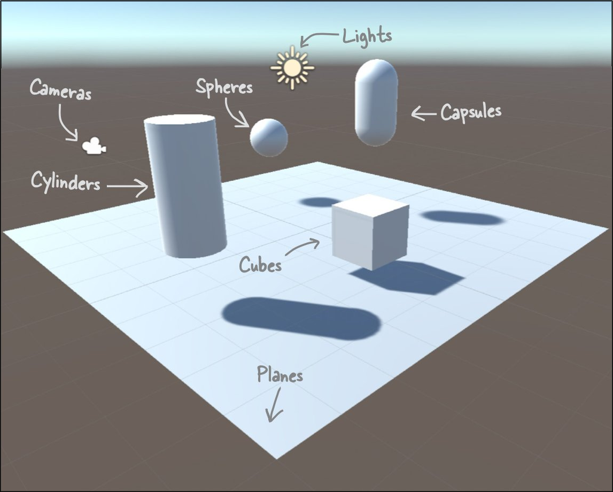

# Welcome to the Head First C# Unity Labs!

## Unity Labs from the book

In the *Head First C# Unity Labs* you'll use [Unity](https://unity.com/), the powerful platform for 2D and 3D game development, to explore C# and practice your C# skills.
* [`Unity_Lab_1_Explore_CSharp_with_Unity.pdf`](https://github.com/head-first-csharp/fourth-edition/raw/master/Unity_Labs/Unity_Lab_1_Explore_CSharp_with_Unity.pdf) – Explore C# with Unity
* [`Unity_Lab_2_Write_CSharp_Code_for_Unity.pdf`](https://github.com/head-first-csharp/fourth-edition/raw/master/Unity_Labs/Unity_Lab_2_Write_CSharp_Code_for_Unity.pdf) – Write C# Code for Unity
* [`Unity_Lab_3_GameObject_Instances.pdf`](https://github.com/head-first-csharp/fourth-edition/raw/master/Unity_Labs/Unity_Lab_3_GameObject_Instances.pdf) – GameObject Instances
* [`Unity_Lab_4_User_Interfaces.pdf`](https://github.com/head-first-csharp/fourth-edition/raw/master/Unity_Labs/Unity_Lab_4_User_Interfaces.pdf) – User Interfaces
* [`Unity_Lab_5_Raycasting.pdf`](https://github.com/head-first-csharp/fourth-edition/raw/master/Unity_Labs/Unity_Lab_5_Raycasting.pdf) – Raycasting
* [`Unity_Lab_6_Scene_Navigation.pdf`](https://github.com/head-first-csharp/fourth-edition/raw/master/Unity_Labs/Unity_Lab_6_Scene_Navigation.pdf) – Scene Navigation

## Additional Unity Labs

There's more to learn about Unity! We've written additional Unity Labs that go beyond the material in the book to teach you important Unity topics, and give you more practice building 3D games.
* [`Unity_Lab_7_Physics.pdf`](https://github.com/head-first-csharp/fourth-edition/raw/master/Unity_Labs/Unity_Lab_7_Physics.pdf) – Physics
* [`Unity_Lab_8_Collision_Detection.pdf`](https://github.com/head-first-csharp/fourth-edition/raw/master/Unity_Labs/Unity_Lab_8_Collision_Detection.pdf) - Collision Detection
* **🚨 ➜ NEW! ➜ 🚨** [`Unity_Lab_9_Unity_Boss_Battle.pdf`](https://github.com/head-first-csharp/fourth-edition/raw/master/Unity_Labs/Unity_Lab_9_Unity_Boss_Battle.pdf) - Unity Boss Battle
* `Unity_Lab_10_robots.pdf` - robots (coming soon!)

## Unity Lab code

You can find the code for the Unity Lab projects in the [`Code/Unity_Labs/ folder`](https://github.com/head-first-csharp/fourth-edition/tree/master/Code/Unity_Labs/). You can load a project into Unity by:
 * Downloading it (or cloning this whole repository)
 * Adding its folder to Unity Hub
 * Opening it in Unity Hub
 * Opening *SampleScene* from the *Scenes* folder
